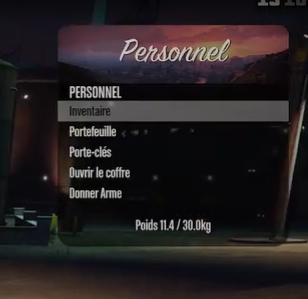

<h1 align="center">
    player-menu
</h1>

<div align="center">
    
</div>

## Requirements

- Node > v18
- Pnpm > v9.5

## Development

### Hot Building

While developing your resource, this boilerplate offers
a `watch` script that will automatically hot rebuild on any
change within the `client`, `server` or `web` directories.

```sh
pnpm watch
```

_This script still requires you restart the resource for the
changes to be reflected in-game_

### Entry Points

**Client** - `./client/src/client.ts`

**Web** - `./web/src/main.ts`

### Nui

Nui is available through a react application you can find in `web` folder.
The file `client/src/nui.ts` contain `RegisterNUICallback` method, which work like the lua implementation to avoid complexity.

## Production Build

Once you have completed the development phase of your resource,
you must create an optimized & minimized production build, using
the `build` script.

```sh
pnpm build
```

## UI desing



## Client commands

| cmd              | args | description      | usage              |
| ---------------- | ---- | ---------------- | ------------------ |
| player-menu:open | N/A  | Open player menu | `player-menu:open` |

## Server commands

| cmd | args | description | usage |
| --- | ---- | ----------- | ----- |
|     |      |             |       |
